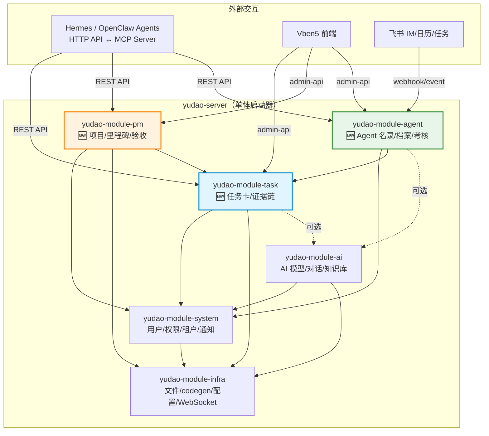
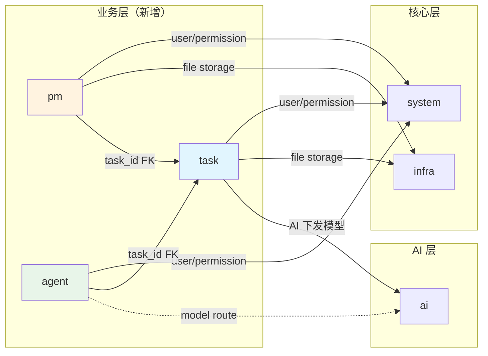
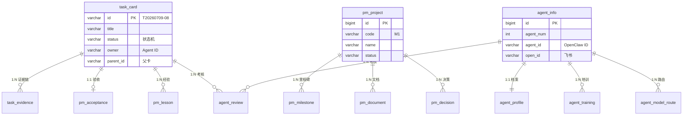
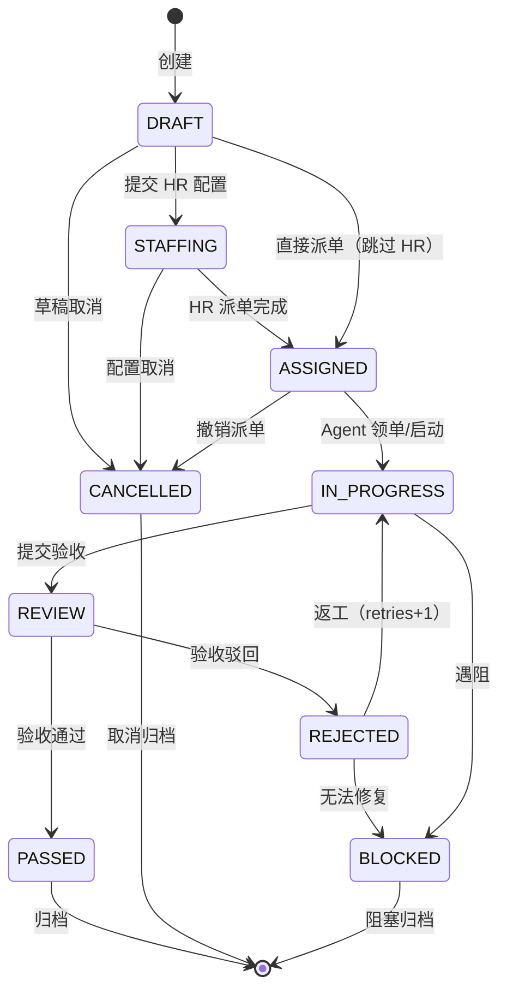
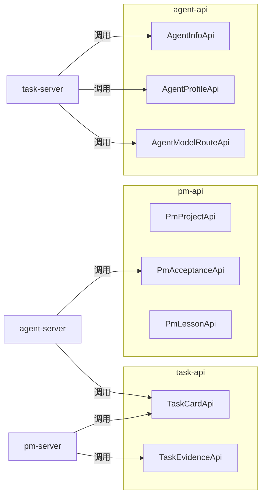

# 🏛️ 架构设计 · yudao 业务中台三新模块

> 版本：v1.0 | 编制：架构师 | 日期：2026-07-09
> 关联：📄 [00-总纲.md](./00-总纲.md) | 📊 [PROGRESS.md](./PROGRESS.md)
> 分支：master-jdk25（JDK 25 + Spring Boot 4.1 + Spring AI 2.0）
> 任务卡：T20260709-08

---

## 目录

1. [模块依赖关系图](#1-模块依赖关系图)
2. [模块边界定义](#2-模块边界定义)
3. [数据库表设计（DDL）](#3-数据库表设计ddl)
4. [API 契约（RESTful）](#4-api-契约restful)
5. [任务卡字段映射表](#5-任务卡字段映射表)
6. [codegen 可用范围评估](#6-codegen-可用范围评估)

---

## 1. 模块依赖关系图

### 1.1 整体架构分层



### 1.2 模块间依赖关系（精确）



### 1.3 子模块结构（标准 yudao 双子模块）

```
yudao-module-task/
├── yudao-module-task-api/        # 对外暴露的接口契约（Feign + DTO + enums）
│   └── src/main/java/.../task/
│       ├── api/                  # RPC 接口（TaskCardApi, TaskEvidenceApi）
│       │   ├── card/dto/
│       │   └── evidence/dto/
│       └── enums/                # 枚举常量（TaskStatusEnum, TaskPriorityEnum...）
│
└── yudao-module-task-server/     # 业务实现（Controller + Service + DAL）
    └── src/main/java/.../task/
        ├── controller/admin/card/
        ├── controller/admin/evidence/
        ├── service/card/
        ├── service/evidence/
        ├── dal/
        │   ├── dataobject/       # Entity
        │   ├── mysql/            # Mapper
        │   └── redis/
        ├── mq/
        └── job/                  # 定时任务（可选）

yudao-module-pm/      # 同构（pm_project / pm_milestone / ...）
yudao-module-agent/   # 同构（agent_info / agent_profile / ...）
```

### 1.4 依赖矩阵

| 模块 | 依赖 system | 依赖 infra | 依赖 ai | 依赖 task | 依赖 pm | 依赖 agent |
|------|:---:|:---:|:---:|:---:|:---:|:---:|
| **task** | ✅ | ✅ | ⚡可选 | — | — | — |
| **pm** | ✅ | ✅ | — | ✅ | — | — |
| **agent** | ✅ | — | ⚡可选 | ✅ | — | — |

> ✅ = 强依赖 | ⚡可选 = 可通过 API 解耦，不引入 Maven 依赖

---

## 2. 模块边界定义

### 2.1 yudao-module-task（任务微服务）

**职责边界：**

| 职责 | 说明 |
|------|------|
| 任务卡生命周期管理 | DRAFT → STAFFING → ASSIGNED → IN_PROGRESS → REVIEW → PASSED/REJECTED → CANCELLED/BLOCKED |
| 证据链记录 | 每个任务执行动作的时间线证据（URL/COMMAND/FILE_PATH/LOG/SCREENSHOT） |
| 状态机引擎 | 流程阶段（1-12 步）驱动，门禁校验（缺 issue/文档引用/阶段 = API 拒绝） |
| 派单/领单协议 | Hermes/OpenClaw Agent 通过 API 领取、更新、提交任务 |
| 父子卡关联 | parent_id 支持任务拆分层级 |

**api 子模块暴露的接口契约：**

| 接口 | 方法 | 说明 |
|------|------|------|
| `TaskCardApi.getCard(id)` | RPC | 跨模块查询任务卡（PM 模块用） |
| `TaskCardApi.getCardListByIds(ids)` | RPC | 批量查询（PM 验收、Agent 考核用） |
| `TaskCardApi.validateCard(id)` | RPC | 校验卡是否满足门禁条件 |
| `TaskEvidenceApi.listByTaskId(taskId)` | RPC | 查询任务证据链 |

**不做的事：**
- ❌ 不做 Agent 信息管理（归属 agent 模块）
- ❌ 不做项目级里程碑管理（归属 pm 模块）
- ❌ 不做验收裁决（由 pm 模块的 `pm_acceptance` 负责）

---

### 2.2 yudao-module-pm（项目管理）

**职责边界：**

| 职责 | 说明 |
|------|------|
| 项目登记册 | 全局项目列表（code/name/status/progress），对齐 Obsidian 登记册 |
| 里程碑管理 | M0/M1/M2... 的目标、交付物、验收标准、日期 |
| 文档管理 | 总纲/PRD/架构/开发文档的版本化引用（file_token 指向 infra 文件服务） |
| 决策队列 | UQ（Unanswered Questions）的记录、状态流转、触发条件监控 |
| 验收记录 | 任务卡完成后由 reviewer 执行验收（PASSED/REJECTED），含验证命令与输出 |
| 经验库 | SUCCESS/PITFALL/PLAYBOOK 经验卡的记录与标签检索 |

**api 子模块暴露的接口契约：**

| 接口 | 方法 | 说明 |
|------|------|------|
| `PmProjectApi.getProject(id)` | RPC | 查询项目基本信息 |
| `PmAcceptanceApi.getByTaskId(taskId)` | RPC | 查询任务的验收结果（task 模块回调用） |
| `PmLessonApi.listByTags(tags)` | RPC | 按标签检索经验卡（Agent 培训用） |

**不做的事：**
- ❌ 不做任务卡 CRUD（由 task 模块负责）
- ❌ 不做 Agent 档案（由 agent 模块负责）
- ❌ 通过 `task_id` 外键关联任务卡，不持有 task 表

---

### 2.3 yudao-module-agent（Agent 管理）

**职责边界：**

| 职责 | 说明 |
|------|------|
| Agent 名录 | 编号、名称、角色、飞书 app_id/open_id、状态（STAFF/EXTERNAL/DISABLED） |
| 能力档案 | 技能标签、分配数、一次通过率、返工率、当前 WIP、评级（S~D）、模型梯队 |
| 五维考核 | 每张卡验收后自动生成考核记录（pass/ontime/evidence/compliance/collab） |
| 培训记录 | 触发原因、培训材料、挂载记录、考试结果、生效日期 |
| 模型路由 | 按 agent × 任务标签 → 推荐模型（tier L/T） |

**api 子模块暴露的接口契约：**

| 接口 | 方法 | 说明 |
|------|------|------|
| `AgentInfoApi.getAgentByAgentId(agentId)` | RPC | 按 OpenClaw agent_id 查 Agent（task 模块派单校验用） |
| `AgentProfileApi.getProfile(agentId)` | RPC | 查能力档案（HR 工作台用） |
| `AgentProfileApi.canTakeTask(agentId, tags)` | RPC | 校验 Agent 是否有资格领取带特定标签的任务（WIP 限制+技能匹配） |
| `AgentModelRouteApi.routeModel(agentId, taskTag)` | RPC | 查询推荐模型（task 模块下发时用） |

**不做的事：**
- ❌ 不做任务卡管理
- ❌ 不做飞书消息发送（由 system 模块的 notify/mail/sms 负责）
- ❌ 通过 `task_id` 外键关联任务卡，不持有 task 表

---

## 3. 数据库表设计（DDL）

> 数据库：MySQL 8.x（utf8mb4 / utf8mb4_general_ci）
> 约定：所有表包含系统字段（creator, create_time, updater, update_time, deleted, tenant_id）
> 主键策略：业务表 varchar ID（task_card），其余 bigint AUTO_INCREMENT

### 3.1 yudao-module-task

#### 3.1.1 task_card — 任务卡主表

```sql
CREATE TABLE `task_card` (
  `id`             VARCHAR(20)   NOT NULL COMMENT '卡号（如 T20260709-08）',
  `title`          VARCHAR(200)  NOT NULL COMMENT '任务标题',
  `status`         VARCHAR(20)   NOT NULL DEFAULT 'DRAFT' COMMENT '状态机：DRAFT/STAFFING/ASSIGNED/IN_PROGRESS/REVIEW/PASSED/REJECTED/CANCELLED/BLOCKED',
  `priority`       VARCHAR(5)    NULL DEFAULT 'P2' COMMENT '优先级：P0/P1/P2',
  `level`          VARCHAR(5)    NULL DEFAULT 'L2' COMMENT '难度等级：L1/L2/L3',
  `tags`           VARCHAR(500)  NULL COMMENT '标签（JSON 数组字符串，如 ["seo","content"]）',
  `owner`          VARCHAR(50)   NULL COMMENT '负责 Agent ID',
  `collaborators`  VARCHAR(500)  NULL COMMENT '协作方（JSON 数组，agent_id 列表）',
  `parent_id`      VARCHAR(20)   NULL COMMENT '父任务卡 ID（支持拆分层级）',
  `github_issue`   VARCHAR(20)   NULL COMMENT 'GitHub Issue 编号',
  `evidence_level` VARCHAR(5)    NULL DEFAULT 'E2' COMMENT '证据等级：E1-E4',
  `model`          VARCHAR(50)   NULL COMMENT '下发模型（如 claude-sonnet-4-20250514）',
  `deadline`       DATETIME      NULL COMMENT '截止时间',
  `retries`        INT           NOT NULL DEFAULT 0 COMMENT '重试次数',
  `process_stage`  INT           NULL COMMENT '流程阶段（1-12）',
  `doc_ref`        VARCHAR(500)  NULL COMMENT '开发文档引用（门禁字段，缺失则拒绝提交）',
  `skill_tags`     VARCHAR(200)  NULL COMMENT '技能标签（供 HR 选派，逗号分隔）',
  `difficulty`     VARCHAR(10)   NULL COMMENT '难度描述',
  `scope_summary`  TEXT          NULL COMMENT '范围摘要',
  -- 系统字段
  `creator`        VARCHAR(64)   NULL DEFAULT '' COMMENT '创建者',
  `create_time`    DATETIME      NOT NULL DEFAULT CURRENT_TIMESTAMP COMMENT '创建时间',
  `updater`        VARCHAR(64)   NULL DEFAULT '' COMMENT '更新者',
  `update_time`    DATETIME      NOT NULL DEFAULT CURRENT_TIMESTAMP ON UPDATE CURRENT_TIMESTAMP COMMENT '更新时间',
  `deleted`        BIT(1)        NOT NULL DEFAULT b'0' COMMENT '是否删除',
  `tenant_id`      BIGINT        NOT NULL DEFAULT 0 COMMENT '租户编号',
  PRIMARY KEY (`id`),
  KEY `idx_status` (`status`),
  KEY `idx_owner` (`owner`),
  KEY `idx_parent_id` (`parent_id`),
  KEY `idx_tenant_id` (`tenant_id`)
) ENGINE=InnoDB DEFAULT CHARSET=utf8mb4 COLLATE=utf8mb4_general_ci COMMENT='任务卡主表';
```

#### 3.1.2 task_evidence — 证据链

```sql
CREATE TABLE `task_evidence` (
  `id`            BIGINT        NOT NULL AUTO_INCREMENT COMMENT '主键',
  `task_id`       VARCHAR(20)   NOT NULL COMMENT '任务卡 ID',
  `seq`           INT           NOT NULL DEFAULT 1 COMMENT '顺序号（同一任务内自增）',
  `timestamp`     DATETIME      NOT NULL DEFAULT CURRENT_TIMESTAMP COMMENT '记录时间',
  `action`        VARCHAR(200)  NOT NULL COMMENT '动作描述',
  `evidence_type` VARCHAR(20)   NOT NULL COMMENT '证据类型：URL/COMMAND/FILE_PATH/LOG/SCREENSHOT',
  `content`       TEXT          NULL COMMENT '证据内容',
  `operator`      VARCHAR(50)   NULL COMMENT '操作者 Agent ID',
  -- 系统字段
  `creator`       VARCHAR(64)   NULL DEFAULT '' COMMENT '创建者',
  `create_time`   DATETIME      NOT NULL DEFAULT CURRENT_TIMESTAMP COMMENT '创建时间',
  `updater`       VARCHAR(64)   NULL DEFAULT '' COMMENT '更新者',
  `update_time`   DATETIME      NOT NULL DEFAULT CURRENT_TIMESTAMP ON UPDATE CURRENT_TIMESTAMP COMMENT '更新时间',
  `deleted`       BIT(1)        NOT NULL DEFAULT b'0' COMMENT '是否删除',
  `tenant_id`     BIGINT        NOT NULL DEFAULT 0 COMMENT '租户编号',
  PRIMARY KEY (`id`),
  UNIQUE KEY `uk_task_seq` (`task_id`, `seq`),
  KEY `idx_task_id` (`task_id`),
  KEY `idx_tenant_id` (`tenant_id`)
) ENGINE=InnoDB DEFAULT CHARSET=utf8mb4 COLLATE=utf8mb4_general_ci COMMENT='任务证据链';
```

---

### 3.2 yudao-module-pm

#### 3.2.1 pm_project — 项目登记册

```sql
CREATE TABLE `pm_project` (
  `id`        BIGINT        NOT NULL AUTO_INCREMENT COMMENT '主键',
  `code`      VARCHAR(20)   NOT NULL COMMENT '项目编号（如 M1）',
  `name`      VARCHAR(100)  NOT NULL COMMENT '项目名称',
  `status`    VARCHAR(10)   NOT NULL DEFAULT 'ACTIVE' COMMENT '状态：ACTIVE/PAUSED/WARNING/FROZEN/COMPLETED/RED',
  `owner`     VARCHAR(50)   NULL COMMENT '负责人 Agent ID',
  `repo_url`  VARCHAR(200)  NULL COMMENT '仓库地址',
  `progress`  INT           NOT NULL DEFAULT 0 COMMENT '进度（0-100）',
  `summary`   TEXT          NULL COMMENT '总纲摘要',
  `doc_url`   VARCHAR(200)  NULL COMMENT '总纲文档地址',
  -- 系统字段
  `creator`       VARCHAR(64)   NULL DEFAULT '' COMMENT '创建者',
  `create_time`   DATETIME      NOT NULL DEFAULT CURRENT_TIMESTAMP COMMENT '创建时间',
  `updater`       VARCHAR(64)   NULL DEFAULT '' COMMENT '更新者',
  `update_time`   DATETIME      NOT NULL DEFAULT CURRENT_TIMESTAMP ON UPDATE CURRENT_TIMESTAMP COMMENT '更新时间',
  `deleted`       BIT(1)        NOT NULL DEFAULT b'0' COMMENT '是否删除',
  `tenant_id`     BIGINT        NOT NULL DEFAULT 0 COMMENT '租户编号',
  PRIMARY KEY (`id`),
  UNIQUE KEY `uk_code` (`code`),
  KEY `idx_tenant_id` (`tenant_id`)
) ENGINE=InnoDB DEFAULT CHARSET=utf8mb4 COLLATE=utf8mb4_general_ci COMMENT='项目登记册';
```

#### 3.2.2 pm_milestone — 里程碑

```sql
CREATE TABLE `pm_milestone` (
  `id`                 BIGINT        NOT NULL AUTO_INCREMENT COMMENT '主键',
  `project_id`         BIGINT        NOT NULL COMMENT '项目 ID',
  `code`               VARCHAR(20)   NOT NULL COMMENT '里程碑编号（如 M1）',
  `name`               VARCHAR(100)  NOT NULL COMMENT '里程碑名称',
  `objective`          TEXT          NULL COMMENT '目标',
  `deliverables`       TEXT          NULL COMMENT '交付物',
  `acceptance_criteria` TEXT         NULL COMMENT '验收标准',
  `status`             VARCHAR(10)   NOT NULL DEFAULT 'PLANNED' COMMENT '状态',
  `start_date`         DATE          NULL COMMENT '开始日期',
  `end_date`           DATE          NULL COMMENT '结束日期',
  -- 系统字段
  `creator`       VARCHAR(64)   NULL DEFAULT '' COMMENT '创建者',
  `create_time`   DATETIME      NOT NULL DEFAULT CURRENT_TIMESTAMP COMMENT '创建时间',
  `updater`       VARCHAR(64)   NULL DEFAULT '' COMMENT '更新者',
  `update_time`   DATETIME      NOT NULL DEFAULT CURRENT_TIMESTAMP ON UPDATE CURRENT_TIMESTAMP COMMENT '更新时间',
  `deleted`       BIT(1)        NOT NULL DEFAULT b'0' COMMENT '是否删除',
  `tenant_id`     BIGINT        NOT NULL DEFAULT 0 COMMENT '租户编号',
  PRIMARY KEY (`id`),
  KEY `idx_project_id` (`project_id`),
  KEY `idx_tenant_id` (`tenant_id`)
) ENGINE=InnoDB DEFAULT CHARSET=utf8mb4 COLLATE=utf8mb4_general_ci COMMENT='项目里程碑';
```

#### 3.2.3 pm_document — 项目文档

```sql
CREATE TABLE `pm_document` (
  `id`              BIGINT        NOT NULL AUTO_INCREMENT COMMENT '主键',
  `project_id`      BIGINT        NOT NULL COMMENT '项目 ID',
  `title`           VARCHAR(200)  NOT NULL COMMENT '文档标题',
  `doc_type`        VARCHAR(20)   NOT NULL COMMENT '文档类型：总纲/PRD/架构/开发/PROGRESS',
  `file_token`      VARCHAR(200)  NULL COMMENT 'infra 文件 token',
  `repo_path`       VARCHAR(200)  NULL COMMENT '仓库内路径',
  `version`         VARCHAR(20)   NULL COMMENT '版本号',
  `approval_status` VARCHAR(20)   NULL DEFAULT 'DRAFT' COMMENT '审批状态',
  -- 系统字段
  `creator`       VARCHAR(64)   NULL DEFAULT '' COMMENT '创建者',
  `create_time`   DATETIME      NOT NULL DEFAULT CURRENT_TIMESTAMP COMMENT '创建时间',
  `updater`       VARCHAR(64)   NULL DEFAULT '' COMMENT '更新者',
  `update_time`   DATETIME      NOT NULL DEFAULT CURRENT_TIMESTAMP ON UPDATE CURRENT_TIMESTAMP COMMENT '更新时间',
  `deleted`       BIT(1)        NOT NULL DEFAULT b'0' COMMENT '是否删除',
  `tenant_id`     BIGINT        NOT NULL DEFAULT 0 COMMENT '租户编号',
  PRIMARY KEY (`id`),
  KEY `idx_project_id` (`project_id`),
  KEY `idx_tenant_id` (`tenant_id`)
) ENGINE=InnoDB DEFAULT CHARSET=utf8mb4 COLLATE=utf8mb4_general_ci COMMENT='项目文档';
```

#### 3.2.4 pm_decision — 决策队列

```sql
CREATE TABLE `pm_decision` (
  `id`                BIGINT        NOT NULL AUTO_INCREMENT COMMENT '主键',
  `project_id`        BIGINT        NOT NULL COMMENT '项目 ID',
  `code`              VARCHAR(20)   NOT NULL COMMENT '决策编号（如 UQ-001）',
  `title`             VARCHAR(200)  NOT NULL COMMENT '决策标题',
  `description`       TEXT          NULL COMMENT '描述',
  `options`           TEXT          NULL COMMENT '选项（JSON 数组）',
  `trigger_condition` VARCHAR(500)  NULL COMMENT '触发条件',
  `status`            VARCHAR(20)   NOT NULL DEFAULT 'PENDING' COMMENT '状态：PENDING/DECIDED/DEFERRED',
  `decision`          TEXT          NULL COMMENT '决策结果',
  `decided_by`        VARCHAR(50)   NULL COMMENT '决策人',
  `decided_at`        DATETIME      NULL COMMENT '决策时间',
  -- 系统字段
  `creator`       VARCHAR(64)   NULL DEFAULT '' COMMENT '创建者',
  `create_time`   DATETIME      NOT NULL DEFAULT CURRENT_TIMESTAMP COMMENT '创建时间',
  `updater`       VARCHAR(64)   NULL DEFAULT '' COMMENT '更新者',
  `update_time`   DATETIME      NOT NULL DEFAULT CURRENT_TIMESTAMP ON UPDATE CURRENT_TIMESTAMP COMMENT '更新时间',
  `deleted`       BIT(1)        NOT NULL DEFAULT b'0' COMMENT '是否删除',
  `tenant_id`     BIGINT        NOT NULL DEFAULT 0 COMMENT '租户编号',
  PRIMARY KEY (`id`),
  UNIQUE KEY `uk_project_code` (`project_id`, `code`),
  KEY `idx_status` (`status`),
  KEY `idx_tenant_id` (`tenant_id`)
) ENGINE=InnoDB DEFAULT CHARSET=utf8mb4 COLLATE=utf8mb4_general_ci COMMENT='决策队列';
```

#### 3.2.5 pm_acceptance — 验收记录

```sql
CREATE TABLE `pm_acceptance` (
  `id`            BIGINT        NOT NULL AUTO_INCREMENT COMMENT '主键',
  `task_id`       VARCHAR(20)   NOT NULL COMMENT '任务卡 ID（FK → task_card）',
  `result`        VARCHAR(20)   NOT NULL COMMENT '验收结果：PASSED/REJECTED',
  `verify_command` VARCHAR(500) NULL COMMENT '验证命令',
  `verify_output`  TEXT         NULL COMMENT '验证输出',
  `reviewer`      VARCHAR(50)   NULL COMMENT '验收人 Agent ID',
  `comment`       TEXT          NULL COMMENT '评语',
  -- 系统字段
  `creator`       VARCHAR(64)   NULL DEFAULT '' COMMENT '创建者',
  `create_time`   DATETIME      NOT NULL DEFAULT CURRENT_TIMESTAMP COMMENT '创建时间',
  `updater`       VARCHAR(64)   NULL DEFAULT '' COMMENT '更新者',
  `update_time`   DATETIME      NOT NULL DEFAULT CURRENT_TIMESTAMP ON UPDATE CURRENT_TIMESTAMP COMMENT '更新时间',
  `deleted`       BIT(1)        NOT NULL DEFAULT b'0' COMMENT '是否删除',
  `tenant_id`     BIGINT        NOT NULL DEFAULT 0 COMMENT '租户编号',
  PRIMARY KEY (`id`),
  KEY `idx_task_id` (`task_id`),
  KEY `idx_tenant_id` (`tenant_id`)
) ENGINE=InnoDB DEFAULT CHARSET=utf8mb4 COLLATE=utf8mb4_general_ci COMMENT='任务验收记录';
```

#### 3.2.6 pm_lesson — 经验库

```sql
CREATE TABLE `pm_lesson` (
  `id`             BIGINT        NOT NULL AUTO_INCREMENT COMMENT '主键',
  `task_id`        VARCHAR(20)   NULL COMMENT '任务卡 ID',
  `type`           VARCHAR(20)   NOT NULL COMMENT '类型：SUCCESS/PITFALL/PLAYBOOK',
  `title`          VARCHAR(200)  NOT NULL COMMENT '标题',
  `content`        TEXT          NULL COMMENT '内容',
  `tags`           VARCHAR(200)  NULL COMMENT '标签（逗号分隔）',
  `reference_count` INT          NOT NULL DEFAULT 0 COMMENT '被引用次数',
  -- 系统字段
  `creator`       VARCHAR(64)   NULL DEFAULT '' COMMENT '创建者',
  `create_time`   DATETIME      NOT NULL DEFAULT CURRENT_TIMESTAMP COMMENT '创建时间',
  `updater`       VARCHAR(64)   NULL DEFAULT '' COMMENT '更新者',
  `update_time`   DATETIME      NOT NULL DEFAULT CURRENT_TIMESTAMP ON UPDATE CURRENT_TIMESTAMP COMMENT '更新时间',
  `deleted`       BIT(1)        NOT NULL DEFAULT b'0' COMMENT '是否删除',
  `tenant_id`     BIGINT        NOT NULL DEFAULT 0 COMMENT '租户编号',
  PRIMARY KEY (`id`),
  KEY `idx_type` (`type`),
  KEY `idx_task_id` (`task_id`),
  KEY `idx_tenant_id` (`tenant_id`)
) ENGINE=InnoDB DEFAULT CHARSET=utf8mb4 COLLATE=utf8mb4_general_ci COMMENT='经验库';
```

---

### 3.3 yudao-module-agent

#### 3.3.1 agent_info — Agent 名录

```sql
CREATE TABLE `agent_info` (
  `id`        BIGINT        NOT NULL AUTO_INCREMENT COMMENT '主键',
  `agent_num` INT           NOT NULL COMMENT 'Agent 编号',
  `agent_id`  VARCHAR(50)   NOT NULL COMMENT 'OpenClaw agent_id',
  `name`      VARCHAR(50)   NOT NULL COMMENT '名称',
  `role`      VARCHAR(200)  NULL COMMENT '角色描述',
  `app_id`    VARCHAR(50)   NULL COMMENT '飞书 app_id',
  `open_id`   VARCHAR(50)   NULL COMMENT '飞书 open_id',
  `status`    VARCHAR(20)   NOT NULL DEFAULT 'STAFF' COMMENT '状态：STAFF/EXTERNAL/DISABLED',
  `note`      TEXT          NULL COMMENT '备注',
  -- 系统字段
  `creator`       VARCHAR(64)   NULL DEFAULT '' COMMENT '创建者',
  `create_time`   DATETIME      NOT NULL DEFAULT CURRENT_TIMESTAMP COMMENT '创建时间',
  `updater`       VARCHAR(64)   NULL DEFAULT '' COMMENT '更新者',
  `update_time`   DATETIME      NOT NULL DEFAULT CURRENT_TIMESTAMP ON UPDATE CURRENT_TIMESTAMP COMMENT '更新时间',
  `deleted`       BIT(1)        NOT NULL DEFAULT b'0' COMMENT '是否删除',
  `tenant_id`     BIGINT        NOT NULL DEFAULT 0 COMMENT '租户编号',
  PRIMARY KEY (`id`),
  UNIQUE KEY `uk_agent_id` (`agent_id`),
  UNIQUE KEY `uk_agent_num` (`agent_num`),
  KEY `idx_open_id` (`open_id`),
  KEY `idx_tenant_id` (`tenant_id`)
) ENGINE=InnoDB DEFAULT CHARSET=utf8mb4 COLLATE=utf8mb4_general_ci COMMENT='Agent 名录';
```

#### 3.3.2 agent_profile — 能力档案

```sql
CREATE TABLE `agent_profile` (
  `id`               BIGINT        NOT NULL AUTO_INCREMENT COMMENT '主键',
  `agent_id`         VARCHAR(50)   NOT NULL COMMENT 'Agent ID',
  `skill_tags`       VARCHAR(500)  NULL COMMENT '技能标签（逗号分隔）',
  `total_assigned`   INT           NOT NULL DEFAULT 0 COMMENT '累计分配数',
  `pass_rate_first`  DECIMAL(5,2)  NULL DEFAULT 0.00 COMMENT '一次通过率',
  `rework_rate`      DECIMAL(5,2)  NULL DEFAULT 0.00 COMMENT '返工率',
  `current_wip`      INT           NOT NULL DEFAULT 0 COMMENT '当前进行中任务数',
  `rating`           VARCHAR(5)    NULL DEFAULT 'B' COMMENT '评级：S/A/B/C/D',
  `model_tier`       VARCHAR(10)   NULL COMMENT '模型梯队：L（大模型）/T（小模型）',
  -- 系统字段
  `creator`       VARCHAR(64)   NULL DEFAULT '' COMMENT '创建者',
  `create_time`   DATETIME      NOT NULL DEFAULT CURRENT_TIMESTAMP COMMENT '创建时间',
  `updater`       VARCHAR(64)   NULL DEFAULT '' COMMENT '更新者',
  `update_time`   DATETIME      NOT NULL DEFAULT CURRENT_TIMESTAMP ON UPDATE CURRENT_TIMESTAMP COMMENT '更新时间',
  `deleted`       BIT(1)        NOT NULL DEFAULT b'0' COMMENT '是否删除',
  `tenant_id`     BIGINT        NOT NULL DEFAULT 0 COMMENT '租户编号',
  PRIMARY KEY (`id`),
  UNIQUE KEY `uk_agent_id` (`agent_id`),
  KEY `idx_rating` (`rating`),
  KEY `idx_tenant_id` (`tenant_id`)
) ENGINE=InnoDB DEFAULT CHARSET=utf8mb4 COLLATE=utf8mb4_general_ci COMMENT='Agent 能力档案';
```

#### 3.3.3 agent_review — 绩效考核

```sql
CREATE TABLE `agent_review` (
  `id`                  BIGINT        NOT NULL AUTO_INCREMENT COMMENT '主键',
  `agent_id`            VARCHAR(50)   NOT NULL COMMENT 'Agent ID',
  `task_id`             VARCHAR(20)   NOT NULL COMMENT '任务卡 ID',
  `dimension_pass`      INT           NULL DEFAULT 0 COMMENT '维度-一次通过（0-100）',
  `dimension_ontime`    INT           NULL DEFAULT 0 COMMENT '维度-准时（0-100）',
  `dimension_evidence`  INT           NULL DEFAULT 0 COMMENT '维度-证据完整（0-100）',
  `dimension_compliance` INT          NULL DEFAULT 0 COMMENT '维度-合规（0-100）',
  `dimension_collab`    INT           NULL DEFAULT 0 COMMENT '维度-协作（0-100）',
  `grade`               VARCHAR(5)    NULL COMMENT '综合评级：S/A/B/C/D',
  `comment`             TEXT          NULL COMMENT '评语',
  -- 系统字段
  `creator`       VARCHAR(64)   NULL DEFAULT '' COMMENT '创建者',
  `create_time`   DATETIME      NOT NULL DEFAULT CURRENT_TIMESTAMP COMMENT '创建时间',
  `updater`       VARCHAR(64)   NULL DEFAULT '' COMMENT '更新者',
  `update_time`   DATETIME      NOT NULL DEFAULT CURRENT_TIMESTAMP ON UPDATE CURRENT_TIMESTAMP COMMENT '更新时间',
  `deleted`       BIT(1)        NOT NULL DEFAULT b'0' COMMENT '是否删除',
  `tenant_id`     BIGINT        NOT NULL DEFAULT 0 COMMENT '租户编号',
  PRIMARY KEY (`id`),
  KEY `idx_agent_id` (`agent_id`),
  KEY `idx_task_id` (`task_id`),
  KEY `idx_tenant_id` (`tenant_id`)
) ENGINE=InnoDB DEFAULT CHARSET=utf8mb4 COLLATE=utf8mb4_general_ci COMMENT='Agent 绩效考核';
```

#### 3.3.4 agent_training — 培训记录

```sql
CREATE TABLE `agent_training` (
  `id`             BIGINT        NOT NULL AUTO_INCREMENT COMMENT '主键',
  `agent_id`       VARCHAR(50)   NOT NULL COMMENT 'Agent ID',
  `trigger_reason` VARCHAR(200)  NULL COMMENT '触发原因',
  `material_path`  VARCHAR(200)  NULL COMMENT '培训材料路径',
  `mount_record`   VARCHAR(500)  NULL COMMENT '挂载记录',
  `exam_result`    TEXT          NULL COMMENT '考试结果',
  `exam_score`     INT           NULL COMMENT '考试分数',
  `effective_date` DATE          NULL COMMENT '生效日期',
  `status`         VARCHAR(20)   NULL DEFAULT 'PENDING' COMMENT '状态',
  -- 系统字段
  `creator`       VARCHAR(64)   NULL DEFAULT '' COMMENT '创建者',
  `create_time`   DATETIME      NOT NULL DEFAULT CURRENT_TIMESTAMP COMMENT '创建时间',
  `updater`       VARCHAR(64)   NULL DEFAULT '' COMMENT '更新者',
  `update_time`   DATETIME      NOT NULL DEFAULT CURRENT_TIMESTAMP ON UPDATE CURRENT_TIMESTAMP COMMENT '更新时间',
  `deleted`       BIT(1)        NOT NULL DEFAULT b'0' COMMENT '是否删除',
  `tenant_id`     BIGINT        NOT NULL DEFAULT 0 COMMENT '租户编号',
  PRIMARY KEY (`id`),
  KEY `idx_agent_id` (`agent_id`),
  KEY `idx_tenant_id` (`tenant_id`)
) ENGINE=InnoDB DEFAULT CHARSET=utf8mb4 COLLATE=utf8mb4_general_ci COMMENT='Agent 培训记录';
```

#### 3.3.5 agent_model_route — 模型路由

```sql
CREATE TABLE `agent_model_route` (
  `id`        BIGINT        NOT NULL AUTO_INCREMENT COMMENT '主键',
  `agent_id`  VARCHAR(50)   NOT NULL COMMENT 'Agent ID',
  `task_tag`  VARCHAR(50)   NOT NULL COMMENT '任务标签',
  `model`     VARCHAR(50)   NOT NULL COMMENT '推荐模型',
  `tier`      VARCHAR(10)   NOT NULL COMMENT '模型梯队：L（大模型）/T（小模型）',
  `priority`  INT           NOT NULL DEFAULT 0 COMMENT '优先级（数字越大越优先）',
  -- 系统字段
  `creator`       VARCHAR(64)   NULL DEFAULT '' COMMENT '创建者',
  `create_time`   DATETIME      NOT NULL DEFAULT CURRENT_TIMESTAMP COMMENT '创建时间',
  `updater`       VARCHAR(64)   NULL DEFAULT '' COMMENT '更新者',
  `update_time`   DATETIME      NOT NULL DEFAULT CURRENT_TIMESTAMP ON UPDATE CURRENT_TIMESTAMP COMMENT '更新时间',
  `deleted`       BIT(1)        NOT NULL DEFAULT b'0' COMMENT '是否删除',
  `tenant_id`     BIGINT        NOT NULL DEFAULT 0 COMMENT '租户编号',
  PRIMARY KEY (`id`),
  UNIQUE KEY `uk_agent_tag` (`agent_id`, `task_tag`),
  KEY `idx_tenant_id` (`tenant_id`)
) ENGINE=InnoDB DEFAULT CHARSET=utf8mb4 COLLATE=utf8mb4_general_ci COMMENT='Agent 模型路由';
```

---

### 3.4 ER 关系图



---

## 4. API 契约（RESTful）

> 路径前缀：`/admin-api/{module}/`
> 认证：Bearer Token（yudao 默认 security 体系）
> 响应格式：`{"code": 0, "data": ..., "msg": ""}`

### 4.1 yudao-module-task

#### 任务卡管理

| 方法 | 路径 | 说明 |
|------|------|------|
| POST | `/admin-api/task/card/create` | 创建任务卡 |
| PUT | `/admin-api/task/card/update` | 更新任务卡（全量） |
| PUT | `/admin-api/task/card/update-status` | 状态流转（含门禁校验） |
| DELETE | `/admin-api/task/card/delete?id=xxx` | 删除任务卡（软删除） |
| GET | `/admin-api/task/card/get?id=xxx` | 查询单张任务卡 |
| GET | `/admin-api/task/card/page` | 分页查询（支持 status/owner/priority/tags 筛选） |
| GET | `/admin-api/task/card/list-by-parent?parentId=xxx` | 查询子卡列表 |

#### 任务卡业务操作

| 方法 | 路径 | 说明 |
|------|------|------|
| POST | `/admin-api/task/card/assign` | 派单（指定 owner + model） |
| POST | `/admin-api/task/card/claim` | 领单（Agent 主动领取，传入 agentId） |
| POST | `/admin-api/task/card/submit-review` | 提交验收（触发门禁校验） |
| POST | `/admin-api/task/card/retry?id=xxx` | 重试（retries+1，状态回退） |
| GET | `/admin-api/task/card/validate-gate?id=xxx` | 校验门禁条件（返回缺失项列表） |

#### 证据链

| 方法 | 路径 | 说明 |
|------|------|------|
| POST | `/admin-api/task/evidence/create` | 追加证据 |
| GET | `/admin-api/task/evidence/list-by-task?taskId=xxx` | 查询任务的证据链 |
| GET | `/admin-api/task/evidence/page` | 分页查询证据 |

#### 请求示例：状态流转

```json
// PUT /admin-api/task/card/update-status
{
  "id": "T20260709-08",
  "status": "IN_PROGRESS",
  "gateCheck": true
}
```

```json
// 响应（门禁失败示例）
{
  "code": 1002001001,
  "data": null,
  "msg": "门禁校验失败：github_issue 不能为空、doc_ref 不能为空"
}
```

#### 请求示例：追加证据

```json
// POST /admin-api/task/evidence/create
{
  "taskId": "T20260709-08",
  "action": "执行数据库迁移",
  "evidenceType": "COMMAND",
  "content": "mysql -u root -p ruoyi-vue-pro < task_card.sql",
  "operator": "fullstack-agent-01"
}
```

---

### 4.2 yudao-module-pm

#### 项目管理

| 方法 | 路径 | 说明 |
|------|------|------|
| POST | `/admin-api/pm/project/create` | 创建项目 |
| PUT | `/admin-api/pm/project/update` | 更新项目 |
| DELETE | `/admin-api/pm/project/delete?id=xxx` | 删除项目 |
| GET | `/admin-api/pm/project/get?id=xxx` | 查询项目详情 |
| GET | `/admin-api/pm/project/page` | 分页查询 |
| GET | `/admin-api/pm/project/list-simple` | 精简列表（下拉选用） |

#### 里程碑管理

| 方法 | 路径 | 说明 |
|------|------|------|
| POST | `/admin-api/pm/milestone/create` | 创建里程碑 |
| PUT | `/admin-api/pm/milestone/update` | 更新里程碑 |
| DELETE | `/admin-api/pm/milestone/delete?id=xxx` | 删除里程碑 |
| GET | `/admin-api/pm/milestone/get?id=xxx` | 查询里程碑 |
| GET | `/admin-api/pm/milestone/list-by-project?projectId=xxx` | 按项目查询 |

#### 文档管理

| 方法 | 路径 | 说明 |
|------|------|------|
| POST | `/admin-api/pm/document/create` | 创建文档引用 |
| PUT | `/admin-api/pm/document/update` | 更新文档引用 |
| DELETE | `/admin-api/pm/document/delete?id=xxx` | 删除文档引用 |
| GET | `/admin-api/pm/document/get?id=xxx` | 查询文档 |
| GET | `/admin-api/pm/document/list-by-project?projectId=xxx` | 按项目查询 |

#### 决策队列

| 方法 | 路径 | 说明 |
|------|------|------|
| POST | `/admin-api/pm/decision/create` | 创建决策项 |
| PUT | `/admin-api/pm/decision/update` | 更新决策项 |
| PUT | `/admin-api/pm/decision/decide` | 执行决策（PENDING → DECIDED） |
| DELETE | `/admin-api/pm/decision/delete?id=xxx` | 删除决策项 |
| GET | `/admin-api/pm/decision/get?id=xxx` | 查询决策项 |
| GET | `/admin-api/pm/decision/page` | 分页查询（支持 status 筛选） |

#### 验收管理

| 方法 | 路径 | 说明 |
|------|------|------|
| POST | `/admin-api/pm/acceptance/create` | 创建验收记录 |
| PUT | `/admin-api/pm/acceptance/update` | 更新验收记录 |
| GET | `/admin-api/pm/acceptance/get-by-task?taskId=xxx` | 按任务查询验收结果 |
| GET | `/admin-api/pm/acceptance/page` | 分页查询 |

#### 经验库

| 方法 | 路径 | 说明 |
|------|------|------|
| POST | `/admin-api/pm/lesson/create` | 创建经验卡 |
| PUT | `/admin-api/pm/lesson/update` | 更新经验卡 |
| DELETE | `/admin-api/pm/lesson/delete?id=xxx` | 删除经验卡 |
| GET | `/admin-api/pm/lesson/get?id=xxx` | 查询经验卡 |
| GET | `/admin-api/pm/lesson/page` | 分页查询（支持 type/tags 筛选） |
| GET | `/admin-api/pm/lesson/search?keyword=xxx` | 全文搜索 |

---

### 4.3 yudao-module-agent

#### Agent 名录

| 方法 | 路径 | 说明 |
|------|------|------|
| POST | `/admin-api/agent/info/create` | 创建 Agent |
| PUT | `/admin-api/agent/info/update` | 更新 Agent |
| DELETE | `/admin-api/agent/info/delete?id=xxx` | 删除（软删除，设为 DISABLED） |
| GET | `/admin-api/agent/info/get?id=xxx` | 查询 Agent 详情 |
| GET | `/admin-api/agent/info/get-by-agent-id?agentId=xxx` | 按 OpenClaw agent_id 查询 |
| GET | `/admin-api/agent/info/page` | 分页查询 |
| POST | `/admin-api/agent/info/import` | 批量导入（Excel） |

#### 能力档案

| 方法 | 路径 | 说明 |
|------|------|------|
| GET | `/admin-api/agent/profile/get?agentId=xxx` | 查询档案 |
| PUT | `/admin-api/agent/profile/update` | 更新档案 |
| GET | `/admin-api/agent/profile/recommend?skillTags=xxx&limit=5` | HR 选派推荐（按标签匹配+WIP+评级） |
| POST | `/admin-api/agent/profile/recalc?agentId=xxx` | 重算统计（从 agent_review 汇总） |

#### 绩效考核

| 方法 | 路径 | 说明 |
|------|------|------|
| POST | `/admin-api/agent/review/create` | 创建考核记录（验收后自动触发） |
| GET | `/admin-api/agent/review/get?id=xxx` | 查询考核记录 |
| GET | `/admin-api/agent/review/list-by-agent?agentId=xxx` | 按 Agent 查询 |
| GET | `/admin-api/agent/review/page` | 分页查询 |

#### 培训管理

| 方法 | 路径 | 说明 |
|------|------|------|
| POST | `/admin-api/agent/training/create` | 创建培训记录 |
| PUT | `/admin-api/agent/training/update` | 更新培训记录 |
| GET | `/admin-api/agent/training/get?id=xxx` | 查询培训记录 |
| GET | `/admin-api/agent/training/list-by-agent?agentId=xxx` | 按 Agent 查询 |

#### 模型路由

| 方法 | 路径 | 说明 |
|------|------|------|
| POST | `/admin-api/agent/model-route/create` | 创建路由规则 |
| PUT | `/admin-api/agent/model-route/update` | 更新路由规则 |
| DELETE | `/admin-api/agent/model-route/delete?id=xxx` | 删除路由规则 |
| GET | `/admin-api/agent/model-route/list-by-agent?agentId=xxx` | 按 Agent 查询 |
| GET | `/admin-api/agent/model-route/route?agentId=xxx&taskTag=xxx` | 查询推荐模型 |

---

## 5. 任务卡字段映射表

> Markdown frontmatter → `task_card` 数据库列的完整映射

| Markdown frontmatter 字段 | 数据库列 | 类型 | 说明 |
|---|---|---|---|
| `id` | `id` | VARCHAR(20) | 卡号，如 `T20260709-08` |
| `title` | `title` | VARCHAR(200) | 任务标题 |
| `status` | `status` | VARCHAR(20) | 状态机枚举值 |
| `priority` | `priority` | VARCHAR(5) | P0/P1/P2 |
| `level` | `level` | VARCHAR(5) | L1/L2/L3 |
| `tags` | `tags` | VARCHAR(500) | JSON 数组 → JSON 字符串 |
| `owner` | `owner` | VARCHAR(50) | OpenClaw agent_id |
| `collaborators` | `collaborators` | VARCHAR(500) | JSON 数组 → JSON 字符串 |
| `parent` | `parent_id` | VARCHAR(20) | 父卡号 |
| `github_issue` | `github_issue` | VARCHAR(20) | Issue 编号 |
| `evidence_level` | `evidence_level` | VARCHAR(5) | E1-E4 |
| `model` | `model` | VARCHAR(50) | 下发模型 |
| `deadline` | `deadline` | DATETIME | ISO 8601 → MySQL DATETIME |
| `retries` | `retries` | INT | 重试次数 |
| `process_stage` | `process_stage` | INT | 流程阶段 1-12 |
| `doc_ref` | `doc_ref` | VARCHAR(500) | 文档章节引用 |
| `skill_tags` | `skill_tags` | VARCHAR(200) | 技能标签 |
| `difficulty` | `difficulty` | VARCHAR(10) | 难度描述 |
| `scope` / `scope_summary` | `scope_summary` | TEXT | 范围摘要 |
| —（系统字段） | `creator` | VARCHAR(64) | 创建者（自动填充） |
| —（系统字段） | `create_time` | DATETIME | 创建时间（自动填充） |
| —（系统字段） | `updater` | VARCHAR(64) | 更新者（自动填充） |
| —（系统字段） | `update_time` | DATETIME | 更新时间（自动填充） |
| —（系统字段） | `deleted` | BIT(1) | 软删除标记 |
| —（系统字段） | `tenant_id` | BIGINT | 租户隔离 |

**映射规则：**

1. frontmatter 的 YAML key 使用 `snake_case`，与数据库列名一致
2. `tags` 和 `collaborators` 在 YAML 中为列表（`["a", "b"]`），入库时序列化为 JSON 字符串
3. `deadline` 在 YAML 中为 ISO 8601 字符串（如 `2026-07-15T18:00:00+08:00`），入库时转为 `DATETIME`
4. `parent` 在 YAML 中简写为 `parent`，数据库列为 `parent_id`
5. 系统字段不在 frontmatter 中体现，由 yudao 框架自动管理

---

## 6. codegen 可用范围评估

> 背景：M0.5 codegen 被降级（数据源配置问题），待修复后恢复。
> 策略：**标准 CRUD 表用 codegen 生成骨架，含复杂业务逻辑的表手工编写。**

### 6.1 评估矩阵

| 表 | 适合 codegen？ | 复杂度 | 原因 |
|---|:---:|:---:|---|
| `task_card` | ⚠️ **部分** | 高 | 主键是 VARCHAR 非自增；状态机+门禁需手写；CRUD 骨架可 codegen |
| `task_evidence` | ⚠️ **部分** | 中 | CRUD 标准；seq 自增逻辑需手写 |
| `pm_project` | ✅ **是** | 低 | 标准 CRUD，bigint 自增主键，无复杂逻辑 |
| `pm_milestone` | ✅ **是** | 低 | 标准 CRUD |
| `pm_document` | ✅ **是** | 低 | 标准 CRUD，file_token 关联 infra |
| `pm_decision` | ⚠️ **部分** | 中 | CRUD 标准；`decide` 状态流转需手写 |
| `pm_acceptance` | ⚠️ **部分** | 中 | CRUD 标准；验收触发逻辑需手写 |
| `pm_lesson` | ✅ **是** | 低 | 标准 CRUD |
| `agent_info` | ✅ **是** | 低 | 标准 CRUD；批量导入需手写 |
| `agent_profile` | ⚠️ **部分** | 中 | CRUD 标准；统计重算+推荐算法需手写 |
| `agent_review` | ✅ **是** | 低 | 标准 CRUD |
| `agent_training` | ✅ **是** | 低 | 标准 CRUD |
| `agent_model_route` | ✅ **是** | 低 | 标准 CRUD |

### 6.2 推荐执行顺序

#### 第一批：codegen 生成（修复 M0.5 后立即执行）

可一次性 codegen 生成骨架的表（7 张）：

1. `pm_project` ✅
2. `pm_milestone` ✅
3. `pm_document` ✅
4. `pm_lesson` ✅
5. `agent_info` ✅
6. `agent_review` ✅
7. `agent_training` ✅
8. `agent_model_route` ✅

> 这些表特点：bigint 自增主键、标准 CRUD、无状态机、无复杂业务校验。
> codegen 产物：Controller + Service + Mapper + VO + 前端页面 + 菜单 SQL，一步到位。

#### 第二批：codegen 骨架 + 手工增强

需要 codegen 生成 CRUD 骨架后再手工增强业务逻辑的表（5 张）：

1. `task_card` — 在 codegen 基础上增加：VARCHAR 主键策略、状态机引擎、门禁校验、派单/领单 API
2. `task_evidence` — 在 codegen 基础上增加：seq 自动编号、证据类型校验
3. `pm_decision` — 在 codegen 基础上增加：`decide` 状态流转 API
4. `pm_acceptance` — 在 codegen 基础上增加：验收触发联动（写 agent_review）
5. `agent_profile` — 在 codegen 基础上增加：统计重算、HR 推荐算法

#### 第三批：纯手工编写

无（所有表至少 CRUD 骨架可由 codegen 生成）。

### 6.3 codegen 修复清单（M0.5 降级项）

在 codegen 可用前，需解决以下数据源配置问题：

| # | 问题 | 解决方案 |
|---|------|----------|
| 1 | codegen 数据源指向的数据库名不匹配 | 在 `infra_codegen_db` 配置中指定 `ruoyi-vue-pro` 库 |
| 2 | JDK25 + Spring Boot 4.1 下 Druid 连接池兼容性 | 确认 Druid 版本 ≥ 1.2.24 或切换 HikariCP |
| 3 | 前端模板类型选择 | 选用 `Vben5` 模板类型（CodegenFrontTypeEnum.VBEN5） |

### 6.4 task_card 特殊处理说明

`task_card` 是唯一使用 VARCHAR 主键的表，codegen 时需注意：

1. **codegen 配置**：将 `id` 列的主键策略设为 `assign`（手工赋值），非 `auto`
2. **ID 生成规则**：格式 `{DATE}-{SEQ}`，如 `T20260709-08`，由 Service 层生成
3. **创建逻辑**：`createCard()` 方法接收前端传入数据后，自动生成 ID 再 insert
4. **前端页面**：codegen 生成的表单页面需去掉 ID 输入框（改为只读展示）

---

## 附录 A：状态机定义

### task_card 状态流转图



### 门禁规则（status → REVIEW 时校验）

| 校验项 | 条件 | 失败动作 |
|--------|------|----------|
| GitHub Issue | `github_issue IS NOT NULL` | 拒绝提交 |
| 文档引用 | `doc_ref IS NOT NULL AND doc_ref != ''` | 拒绝提交 |
| 流程阶段 | `process_stage >= 1` | 拒绝提交 |
| Owner 已分配 | `owner IS NOT NULL` | 拒绝提交 |
| 证据链 | `task_evidence` 至少 1 条 | 警告但允许 |

---

## 附录 B：枚举常量定义

| 枚举类 | 所在包 | 值 |
|--------|--------|-----|
| `TaskStatusEnum` | `task.enums` | DRAFT, STAFFING, ASSIGNED, IN_PROGRESS, REVIEW, PASSED, REJECTED, CANCELLED, BLOCKED |
| `TaskPriorityEnum` | `task.enums` | P0, P1, P2 |
| `TaskLevelEnum` | `task.enums` | L1, L2, L3 |
| `EvidenceTypeEnum` | `task.enums` | URL, COMMAND, FILE_PATH, LOG, SCREENSHOT |
| `ProjectStatusEnum` | `pm.enums` | ACTIVE, PAUSED, WARNING, FROZEN, COMPLETED, RED |
| `DocTypeEnum` | `pm.enums` | 总纲, PRD, 架构, 开发, PROGRESS |
| `DecisionStatusEnum` | `pm.enums` | PENDING, DECIDED, DEFERRED |
| `AcceptanceResultEnum` | `pm.enums` | PASSED, REJECTED |
| `LessonTypeEnum` | `pm.enums` | SUCCESS, PITFALL, PLAYBOOK |
| `AgentStatusEnum` | `agent.enums` | STAFF, EXTERNAL, DISABLED |
| `AgentRatingEnum` | `agent.enums` | S, A, B, C, D |
| `ModelTierEnum` | `agent.enums` | L, T |

---

## 附录 C：RPC 接口速查

> RPC 接口定义在 `{module}-api` 子模块中，供跨模块调用，单体模式下走本地 Bean，微服务模式下走 Feign。



---

_本文档随 M1.1 卡交付，后续修改请提交 PR 并更新版本号。_
